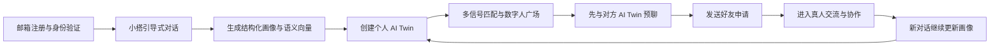
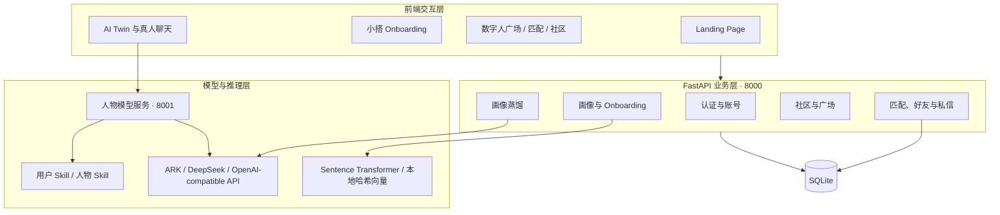

# Darlink

> 面向通班及高校学生的 AI Twin 协作与社交匹配平台

Darlink 通过引导式对话理解用户的兴趣、价值观、思维方式和沟通习惯，为每位学生生成一个可持续更新、能够自然对话的 AI Twin（个人数字分身）。系统再综合语义画像、共同兴趣、使用意图和人格特征进行多信号匹配，帮助用户寻找学习搭子、项目队友、活动伙伴，以及其他真正“同频”的人。

**Darlink 不试图让 AI 代替真实关系，而是让 AI 降低第一次认识、判断是否合拍和发起交流的成本。**

[在线体验](https://layers-recall-resistant-adrian.trycloudflare.com/app.html?auth=real#login_luminous_identity_english_refined) · [Demo 与参赛材料](https://disk.pku.edu.cn/link/AA881213215C314A5F990FFC16AE22EB31) · [问题反馈](https://v.wjx.cn/vm/eRwV0sS.aspx)

---

## 目录

- [项目背景](#项目背景)
- [对通班的实际价值](#对通班的实际价值)
- [核心功能](#核心功能)
- [使用流程](#使用流程)
- [系统架构](#系统架构)
- [核心算法与实现](#核心算法与实现)
- [团队原创工作](#团队原创工作)
- [技术栈](#技术栈)
- [快速开始](#快速开始)
- [配置说明](#配置说明)
- [项目结构](#项目结构)
- [验证状态](#验证状态)
- [AI 与开源工具使用说明](#ai-与开源工具使用说明)
- [数据安全与隐私](#数据安全与隐私)
- [团队协作与分工](#团队协作与分工)
- [后续计划](#后续计划)

---

## 项目背景

在课程大作业、科研课题、创新比赛和学生活动中，我们经常需要寻找新的合作伙伴。但现实中的组队仍高度依赖熟人关系、群聊中的一句自我介绍，或者少量表面标签。

这些方式很难回答更重要的问题：

- 对方真正关心什么，是否愿意长期投入？
- 双方的学习节奏、沟通习惯和合作方式是否兼容？
- 陌生同学之间如何在不过度暴露隐私的情况下，先完成一次低压力的了解？
- 跨学校、跨年级、跨专业的同学如何发现彼此？

传统推荐系统通常只能利用“专业”“兴趣标签”等静态信息，而一段真实对话能够进一步呈现用户如何思考、表达和做决定。Darlink 因此提出一种新的校园连接方式：先通过对话生成 AI Twin，再让数字分身承担介绍、表达和初步筛选工作，最后把真正合适的人带回到真实交流中。

## 对通班的实际价值

Darlink 将通班作为首个重点落地场景，服务通班跨校、跨年级、强科研协作的学习共同体。

### 1. 课程与比赛组队

用户可以选择“学习搭子”或“项目协作”意图。系统不仅比较研究兴趣，还会参考思维方式、目标倾向和沟通风格，降低仅凭一句自我介绍组队带来的信息不足。

### 2. 跨校、跨年级科研连接

AI Twin 能够把用户的兴趣、经验和关注议题转化为可检索的语义画像，帮助不同学校、不同年级的同学发现潜在合作者。

### 3. 班级活动与兴趣社群

数字人广场和校园社区让同学能够围绕学习、技术、艺术、运动和校园活动建立连接，为班级活动组织和兴趣小组形成提供新的入口。

### 4. 降低陌生人破冰成本

匹配结果不仅给出分数，也会提供共同兴趣、目标一致性等匹配理由。用户可以先与对方的 AI Twin 交流，再决定是否发送好友申请或开启真人私聊。

## 核心功能

| 功能 | 说明 | 主要实现 |
| --- | --- | --- |
| 邮箱验证与账号系统 | 支持验证码注册、密码登录和密码重置 | `backend/routes/auth.py` |
| 小搭引导式 Onboarding | 通过自然对话了解基本信息、关系目标和个性信号 | `frontend/onboarding-config.js`、`backend/routes/ai.py` |
| AI Twin 生成 | 将问卷、对话和个人资料整理为结构化画像、向量和专属 Skill | `backend/user_skill_builder.py`、`backend/routes/user_onboarding.py` |
| 增量画像蒸馏 | 从后续聊天中持续提取思维、价值观、兴趣、沟通和语言风格 | `backend/distillation.py` |
| 多信号匹配 | 综合语义、兴趣、意图和人格信号，支持相似型与互补型匹配 | `backend/matching.py` |
| 数字人广场 | 展示用户发布的 AI Twin，支持查看、排序和对话 | `backend/routes/plaza.py` |
| AI Twin 预聊 | 在认识真人前先与数字分身交流，保留上下文和人物语气 | `backend/routes/contextual_chat.py` |
| 好友与私信 | 支持好友申请、申请处理和真人私信 | `backend/routes/friends.py` |
| 校园社区 | 支持用户或 AI Twin 发帖、评论和点赞 | `backend/routes/community.py` |
| 人物盲盒实验 | 探索高辨识度人物 Skill、知识整理和对话风格控制 | `.claude/skills/`、`backend/skill_loader.py` |

人物盲盒是对 Skill 组织、人物一致性和交互方式的实验性探索；Darlink 的主线创新仍是面向真实学生的 AI Twin 生成和用户匹配。

## 使用流程



1. **注册**：用户通过邮箱验证码完成注册并设置密码。
2. **认识自己**：小搭以自然对话的方式完成基础问卷、意图选择和个性探索。
3. **生成 AI Twin**：系统形成结构化画像、语义向量、公开卡片和专属对话 Skill。
4. **发现同伴**：用户可以进入匹配网络或数字人广场，查看候选人及匹配理由。
5. **低压力破冰**：用户先和候选人的 AI Twin 对话，再决定是否发起真人连接。
6. **持续更新**：后续聊天会被用于增量蒸馏，使画像和表达方式随用户变化。

## 系统架构



### 架构设计考虑

- **业务 API 与模型服务分离**：人物对话由独立模型服务负责，账号、画像、匹配和社区逻辑保留在业务后端。
- **画像结构化存储**：原始资料、语义向量和结构化画像分别存储，便于匹配、展示和后续更新。
- **模型可替换**：推理入口兼容 ARK、DeepSeek 和 OpenAI-compatible API，降低对单一供应商的依赖。
- **本地降级**：语义模型不可用时可使用确定性的 384 维本地哈希向量，保证受限环境下仍能完成基础匹配。
- **缺失信号降级**：用户资料尚不完整时，匹配算法不会直接失效，而会对现有信号重新分配权重。

## 核心算法与实现

### 1. AI Twin 画像生成

Darlink 的画像由两个阶段构成。

#### Onboarding 即时画像

用户完成引导式对话后，系统将以下内容合并为统一画像：

- 当前目标：学习、社交或其他关系意图；
- 问卷信息：学校、兴趣、节奏、合作偏好等；
- 小搭对话：用户用自然语言表达的选择和理由；
- 画像卡片：可公开展示的简介、标签和 AI Twin 名称；
- 语义向量：用于检索和候选排序的统一文本表示。

系统同时生成用户专属 Skill，使 AI Twin 能够使用第一人称自然表达，同时限制其编造身份、泄露系统提示词或将自己描述成官方账号。

#### 后续对话增量蒸馏

当用户产生新的聊天记录后，系统按增量阈值重新分析最近上下文，提取：

```json
{
  "thinking_style": {
    "logical": 0.0,
    "intuitive": 0.0,
    "systematic": 0.0,
    "creative": 0.0
  },
  "values": {
    "long_term": 0.0,
    "risk_taking": 0.0,
    "independence": 0.0,
    "altruism": 0.0
  },
  "interests": ["technology", "education"],
  "communication": {
    "concise": 0.0,
    "humorous": 0.0,
    "proactive": 0.0,
    "emotional": 0.0
  },
  "voice": {
    "reply_length": "medium",
    "tone": "口语自然",
    "sample_phrases": [],
    "avoid_phrases": []
  },
  "concerns": [],
  "summary": ""
}
```

信息不足的维度使用中性值，解析失败时不覆盖已有画像，避免把一次异常模型输出写入用户档案。

### 2. 多信号匹配

当前匹配由四路信号组成：

```text
综合匹配分数 =
  0.50 × 语义向量余弦相似度
+ 0.20 × 兴趣标签 Jaccard 相似度
+ 0.10 × 使用意图一致度
+ 0.20 × 蒸馏人格特征得分
```

#### 语义相似度

系统把问卷、画像卡片和用户标签拼接成统一文本，通过 `sentence-transformers/all-MiniLM-L6-v2` 生成归一化向量，并计算余弦相似度。

#### 兴趣重合度

兴趣信号来自问卷兴趣、AI Twin 标签和增量蒸馏结果。系统使用 Jaccard 相似度衡量两个标签集合的交集比例。

#### 意图一致度

系统将用户目标归一为学习、社交和关系等场景。同一目标获得更高的意图一致分。

#### 人格特征得分

- **相似型模式**：奖励思维方式和沟通风格接近的候选人；
- **互补型模式**：奖励部分思维和沟通维度形成互补的候选人；
- **价值观维度**：无论哪种模式，都优先奖励基本价值取向的一致性。

#### 缺失信号重归一化

新用户可能还没有完整的聊天蒸馏结果。若某类信号不存在，算法会移除其权重，并把剩余权重重新归一化到 1，而不是将缺失数据当作零分。这让冷启动阶段仍然能够产生可解释的候选排序。

### 3. 可解释推荐

匹配接口除分数外还返回理由标签，例如：

- `shared_interests`：存在共同兴趣；
- `same_intent:study`：均在寻找学习伙伴；
- `personality_similar`：人格信号更偏相似；
- `personality_complementary`：人格信号更偏互补。

这些理由会被前端转化为用户可理解的匹配说明，避免只展示一个来源不明的百分比。

## 团队原创工作

Darlink 允许使用 AI 辅助开发，也调用现有模型 API 和开源模型，但不是对现有工具的简单包装。团队围绕校园连接场景自主完成了以下核心设计、实现和整合：

| 原创部分 | 具体工作 | 代码位置 |
| --- | --- | --- |
| 产品流程 | 设计“引导对话 → AI Twin → 预聊 → 真人连接”的闭环 | `frontend/flow-router.js`、`frontend/prototype-engine.js` |
| 用户画像协议 | 设计 Onboarding 数据结构、公开卡片和多路径画像 | `backend/routes/user_onboarding.py` |
| 增量画像蒸馏 | 设计画像维度、结构化解析、置信度和更新策略 | `backend/distillation.py` |
| 用户专属 Skill | 将用户资料转换成可执行的 AI Twin 对话约束 | `backend/user_skill_builder.py` |
| 多信号匹配 | 实现语义、兴趣、意图、人格四路融合及缺失信号降级 | `backend/matching.py` |
| 对话系统 | 实现人物路由、上下文拼接、流式输出、语言控制和回复清洗 | `backend/routes/contextual_chat.py`、`backend/routes/ai.py` |
| 社交闭环 | 实现好友申请、真人私信、数字人广场和校园社区 | `backend/routes/friends.py`、`backend/routes/community.py` |
| 数据工程 | 实现对话导出、备份、统计和质量分析工具 | `scripts/`、`deploy/data-ops/` |
| 系统集成 | 完成静态前端、FastAPI、模型服务、SQLite 和 Nginx 的整合 | `frontend/`、`backend/`、`model_service/`、`deploy/` |

## 技术栈

| 层级 | 技术 |
| --- | --- |
| 前端 | HTML、CSS、原生 JavaScript、响应式布局、多语言界面 |
| 后端 | Python 3.11、FastAPI、Pydantic、SQLAlchemy |
| 数据库 | SQLite（MVP） |
| 异步通信 | HTTPX、Server-Sent Events |
| 大模型 | Volcengine ARK、DeepSeek、OpenAI-compatible API |
| 向量表示 | Sentence Transformers、NumPy、本地哈希向量降级 |
| 部署 | Uvicorn、Nginx、systemd、Cloudflare Tunnel |
| 工程工具 | GitHub Actions、数据导出与备份脚本、Streamlit 数据面板 |

## 快速开始

### 环境要求

- Python 3.11
- Git
- 可选：Conda
- 可选：可调用的 ARK、DeepSeek 或 OpenAI-compatible API Key

### 1. 克隆仓库

```bash
git clone https://github.com/Alita-xky/Darlink.git
cd Darlink
```

### 2. 创建环境并安装依赖

使用 `venv`：

```bash
python3.11 -m venv .venv
source .venv/bin/activate
python -m pip install --upgrade pip
pip install -r backend/requirements.txt
pip install -r model_service/requirements.txt
```

Windows PowerShell 可使用仓库中的启动脚本：

```powershell
.\start-dev.ps1
```

### 3. 配置环境变量

```bash
cp .env.example .env
```

在 `.env` 中填写至少一组可用的模型配置。没有模型 API Key 时，基础页面和部分人物 Stub 回复仍可调试，但结构化画像蒸馏无法完成。

### 4. 启动模型服务

```bash
cd model_service
python -m uvicorn service:app --reload --port 8001
```

### 5. 启动业务后端

打开第二个终端：

```bash
cd backend
python -m uvicorn app:app --reload --port 8000
```

健康检查：

```bash
curl http://127.0.0.1:8000/health
curl http://127.0.0.1:8001/
```

### 6. 启动前端

打开第三个终端：

```bash
cd frontend
python3 -m http.server 54114
```

访问：

```text
http://127.0.0.1:54114/landing-v14.html
```

前端在本地非标准端口运行时，会将 `/api/` 请求解析到同一主机的 `8000` 端口。生产环境建议使用同域反向代理统一提供前端和 API。

## 配置说明

核心环境变量如下：

| 变量 | 用途 |
| --- | --- |
| `ARK_API_KEY` | Volcengine ARK 主调用密钥 |
| `ARK_DEEPSEEK_API_KEY` | ARK-hosted DeepSeek 备用密钥 |
| `DEEPSEEK_API_KEY` | DeepSeek API 备用密钥 |
| `OPENAI_API_KEY` | OpenAI-compatible 备用密钥 |
| `SMTP_HOST`、`SMTP_USER`、`SMTP_PASSWORD` | 邮箱验证码服务 |
| `AI_CHAT_TIMEOUT` | AI 对话请求超时 |
| `AI_CHAT_MAX_TOKENS` | 对话回复 token 上限 |
| `EMBEDDING_MODEL` | 语义向量模型，默认 `all-MiniLM-L6-v2` |
| `EMBEDDING_BACKEND` | `auto` 或本地哈希降级模式 |
| `DARLINK_TEST_MODE` | 本地联调固定验证码模式；生产必须关闭 |
| `DARLINK_TEST_AUTH_CODE` | 测试模式验证码 |

生产环境禁止提交 `.env`，也不应开启验证码回显或固定测试码。

## 项目结构

```text
Darlink/
├── backend/                    # FastAPI 业务后端
│   ├── app.py                  # 应用入口与路由注册
│   ├── distillation.py         # 用户画像增量蒸馏
│   ├── matching.py             # 多信号匹配算法
│   ├── user_skill_builder.py   # 用户 AI Twin Skill 生成
│   ├── embeddings.py           # 语义向量与本地降级
│   └── routes/                 # 认证、聊天、广场、好友、社区等 API
├── model_service/              # 独立人物模型服务
├── frontend/                   # 可部署的静态前端
│   ├── landing-v14.html        # 产品入口页
│   ├── app.html                # 应用 Shell
│   ├── flow-router.js          # 页面路由与主流程
│   ├── prototype-engine.js     # 交互与 API 接入
│   └── pages/                  # 各页面源码
├── .claude/skills/             # 人物 Skill 与调研资料
├── scripts/                    # 导出、备份、统计、分析工具
├── deploy/                     # Nginx、systemd 与数据运维配置
├── data/                       # 本地数据库与导出目录
└── .github/workflows/          # GitHub Actions 烟雾检查
```

## 验证状态

当前仓库已完成以下基础验证：

- FastAPI 业务应用和模型服务能够加载；
- 认证、Onboarding、画像保存、数字人对话和聊天历史链路已接通；
- 匹配接口能够返回排序、分数和解释标签；
- 好友申请、真人私信、社区帖子与评论具备持久化模型；
- 模型不可用时，人物聊天和语义向量均有受限降级路径；
- GitHub Actions 执行依赖安装、导入检查、路由检查和文档完整性检查；
- Demo 运行过程见[参赛演示材料](https://disk.pku.edu.cn/link/AA881213215C314A5F990FFC16AE22EB31)。

当前验证主要面向 MVP 链路和烟雾检查，不等同于完整的生产级自动化测试或大规模用户实验。项目不会把演示数据直接当作真实效果指标。

## AI 与开源工具使用说明

Darlink 使用 AI 的方式分为两类。

### 产品运行时

- 调用 ARK、DeepSeek 或 OpenAI-compatible API 完成引导对话、画像分析和 AI Twin 回复；
- 使用 Sentence Transformers 生成语义向量；
- 使用团队整理和编写的 Skill 文件约束人物知识、表达方式和身份边界；
- 使用结构化 JSON 协议把模型输出转化为可计算的画像，而不是直接把聊天回复当作匹配结果。

### 开发过程

团队可以使用 AI 辅助编程、文案生成、调试和资料整理，但对生成结果进行人工审阅、修改和系统集成。项目的产品流程、画像协议、匹配方法、数据模型、前后端接口及部署结构均落实为仓库中的可检查代码。

本项目目前没有训练或微调基础大模型，因此不会将提示词工程、API 调用或结构化蒸馏表述为“自主训练模型”。

主要开源组件包括 FastAPI、SQLAlchemy、Pydantic、HTTPX、Sentence Transformers、NumPy 和 Uvicorn。具体版本见各目录下的 `requirements.txt`。

## 数据安全与隐私

AI Twin 涉及用户邮箱、问卷、画像和聊天记录，因此隐私不是附加功能，而是系统设计的一部分。

当前 MVP 采取的基本措施包括：

- API Key 和 SMTP 密钥只通过环境变量配置；
- 密码使用哈希保存，不存储明文密码；
- 公开卡片与完整画像分开组织，前端只展示用于匹配的有限信息；
- 模型输出在写入前进行结构化解析，解析失败不覆盖原画像；
- 生产部署关闭固定测试验证码和开发验证码回显；
- 数据分析脚本应只处理授权数据，公开展示前必须匿名化。

当前仓库仍处于 MVP 阶段。正式生产部署前还需要完成：

- 从公开仓库和 Git 历史中移除真实数据库、原始聊天导出和其他个人数据；
- 增加用户主动导出、删除和撤回画像授权的接口；
- 明确数据保存周期和第三方模型调用告知；
- 增加接口限流、权限审计、日志脱敏和更完整的安全测试；
- 根据规模将 SQLite 迁移到具备更完善权限管理的数据库。

## 团队协作与分工

Darlink 由团队围绕同一产品闭环协同开发，主要工作分为：

| 工作方向 | 主要内容 |
| --- | --- |
| 产品与用户研究 | 场景选择、用户流程、问卷结构、产品定位和反馈收集 |
| 交互与视觉 | Landing、Onboarding、数字人广场、匹配、聊天和社区界面 |
| 后端与数据 | 认证、数据库、会话、好友、私信、社区和数据工具 |
| AI 与算法 | 画像协议、用户 Skill、增量蒸馏、语义向量和匹配算法 |
| 工程与部署 | 模型服务、前后端联调、Nginx、备份、统计和发布流程 

## 后续计划

1. 在通班内部开展小规模、知情同意的种子测试；
2. 使用真实的接受率、会话深度和组队结果校准匹配权重；
3. 增加用户对 AI Twin 画像的查看、纠错和删除能力；
4. 为匹配理由加入更细粒度的证据来源和置信度；
5. 完善单元测试、接口测试、安全检查和持续部署；
6. 迁移到 PostgreSQL，并根据需要引入向量索引；
7. 增加面向课程组队、科研合作和班级活动的专用模式。

## 贡献与反馈

欢迎通过 GitHub Issues 或[反馈问卷](https://v.wjx.cn/vm/eRwV0sS.aspx)提交建议。参与代码贡献前请阅读 [CONTRIBUTING.md](CONTRIBUTING.md)。

## License

本项目代码采用 [MIT License](LICENSE)。人物资料、第三方图片、模型和外部服务仍分别受其原始许可与使用条款约束。

---

**Darlink — 先让 AI 帮你表达，再把真正合适的人带到彼此面前。**
